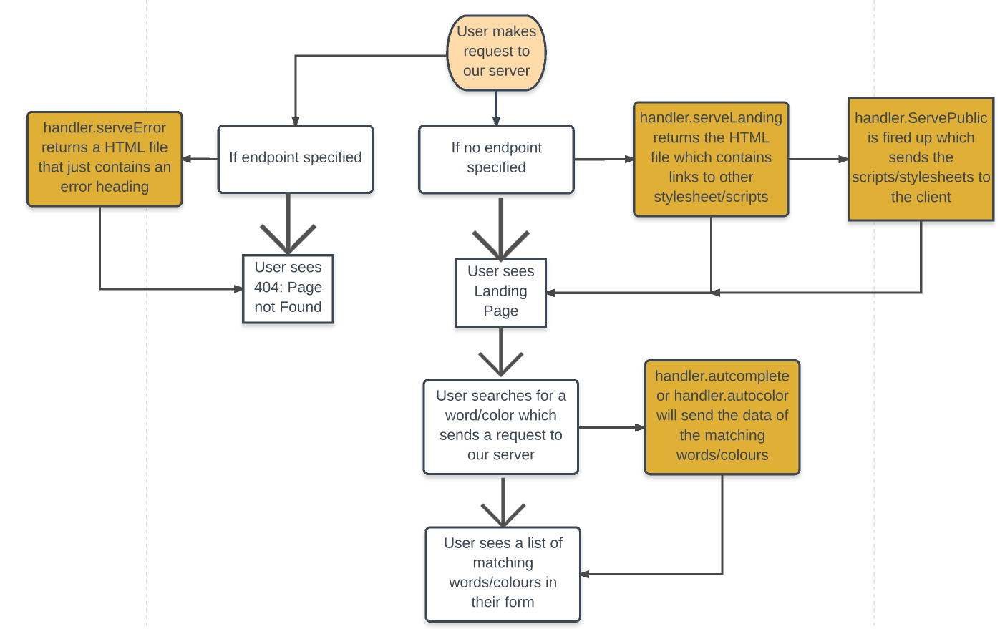
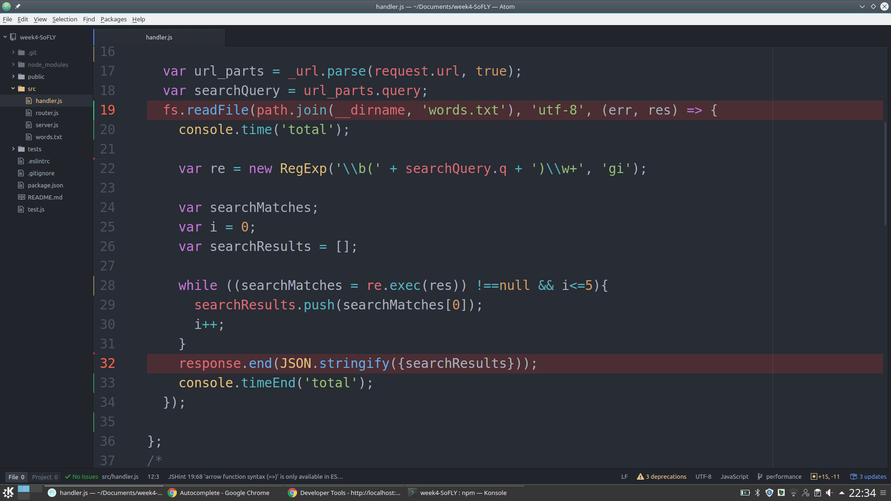
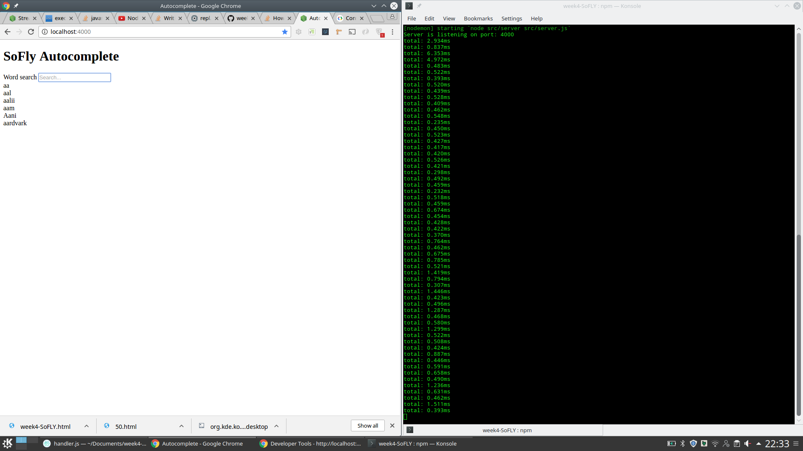

# week4-SoFLY

## Project: Autocomplete Search Words

### User Story

"I want to be able to search an online dictionary where words that I input are autocompleted for me".

### Components

Search bar with drop-down list of 6 autocompleted words that can be tabbed and selected.

### Stretch goal

Link to dictionary definitions of the words.

### Initial plan

=> INCLUDE DIAGRAM OF FRONT & BACK END


### Progress

### Buffer
When you are transferring data, a buffer is a temporary storage space for a chunk of that total data you are transferring.


Instead of waiting for all of the data to be stored in memory we transfer a little bit of data into the buffer. When the buffer's full, the data's passed on and processed.

### Streams

The way a stream works is; data is passed along into the buffer. When the buffer's full small chunks of data is sent to the client.

An example of this is a youtube video, which buffers. We don't wait for the entire video to arrive, but can watch it a bit at a time, depending on your internet speed.

This can greatly improve the performance of our webapp.


### Fs.readFile vs Fs.createReadStream
Fs.readFile loads the entire file in memory before processing it/firing a callback function.

Whereas if we take advantage of a readstream, where we can read the file in chunks of the size we can specify.

The advantage of this is whenever we get a chunk of data we can send it on to the user using a writable stream!

###How?
```
var readStream = fs.readStream(pathname);

```
You can create a variable and set it equal to: fs.createReadStream(pathname);

There is an event called data on createReadStream, which allows us to listen when we receive any chunk of data from the stream and we can add a callback.

```
readstream.on('data', function (chunk) {

    // dosomething with chunks

  })
```

You could also save them the chunks to a variable and do something with it when it's fully loaded into the variable using the end event.

```
response.on('end', function(file){

  //do something with file

  })

  ```

### Performance
There are several ways to check for the performance of your code, e.g. how long a function takes to run.

```console.time()```

You can call ```console.time([label])``` with an optional label at the start of your function. Then you can call ```console.timeEnd([label])``, in the console-log you will be able to see the time difference between these calls.




We have implemented this to show the difference between using .match and .exec and there was a significant difference of around 20-30 ms.
